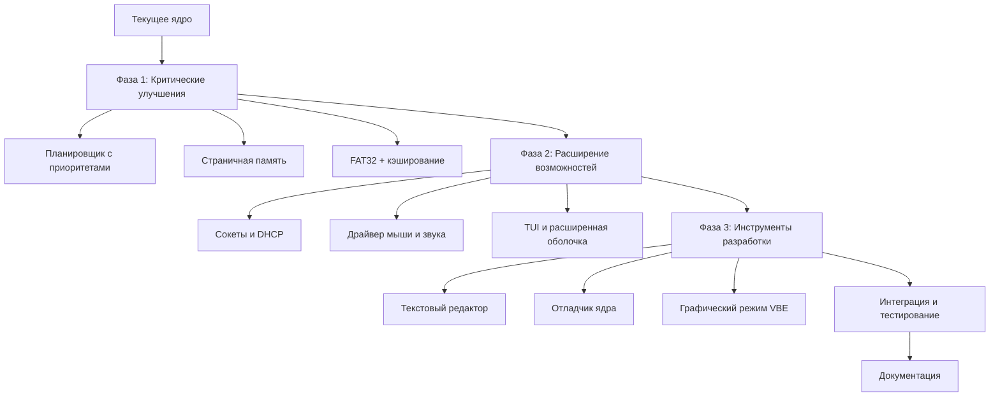

# План улучшения функциональности ядра ОС

## Текущее состояние (на основе WORKLOG.md)

### Реализованные компоненты
1. **Загрузчик** - полная реализация
2. **Базовое ядро** на ассемблере
3. **Драйверы устройств**:
   - Клавиатура (PS/2)
   - Таймер (PIT)
   - Последовательный порт (COM1)
   - VGA (текстовый режим 80x25)
4. **Файловая система** FAT16:
   - Чтение/запись файлов
   - Работа с директориями
   - Поддержка формата 8.3
5. **Сетевые возможности**:
   - Драйвер сетевой карты
   - TCP/IP стек (Ethernet, IP, TCP, UDP, ICMP, ARP)
   - Ping (ICMP Echo)
   - HTTP клиент
   - DNS клиент
6. **Многозадачность**:
   - Поддержка до 16 задач
   - Переключение контекста
7. **Управление памятью**:
   - Выделение/освобождение блоков
8. **Системные вызовы**:
   - Базовый набор вызовов
9. **Оболочка (shell)**:
   - Базовые команды (ls, cd, cat)
   - Интерактивный интерфейс

## Приоритетные направления для улучшения

### 1. Улучшение многозадачности и планировщика
**Текущее состояние**: Базовая реализация переключения между 16 задачами
**Проблемы**: Нет приоритетов, round-robin без оптимизации, нет IPC

**Задачи для реализации**:
- [ ] Реализация планировщика с приоритетами
- [ ] Межпроцессное взаимодействие (IPC) через сообщения
- [ ] Семафоры и мьютексы для синхронизации
- [ ] Управление процессами (fork, exec, wait)
- [ ] Улучшение контекста задач (сохранение FPU состояния)

**Файлы для модификации**:
- [`os/os/src/kernel/task.asm`](os/os/src/kernel/task.asm) - расширение структуры задач
- Новый файл: `os/os/src/kernel/scheduler.asm` - планировщик
- Новый файл: `os/os/src/kernel/ipc.asm` - IPC механизмы

### 2. Расширение файловой системы
**Текущее состояние**: FAT16 с базовыми операциями
**Проблемы**: Ограничения FAT16, нет кэширования, медленная работа

**Задачи для реализации**:
- [ ] Поддержка FAT32 для больших дисков
- [ ] Кэширование дисковых операций
- [ ] Журналирование для отказоустойчивости
- [ ] Поддержка длинных имён файлов
- [ ] Символические ссылки
- [ ] Управление правами доступа

**Файлы для модификации**:
- [`os/os/src/kernel/fs.asm`](os/os/src/kernel/fs.asm) - расширение для FAT32
- [`os/os/src/kernel/fat.asm`](os/os/src/kernel/fat.asm) - обновление таблиц
- Новый файл: `os/os/src/kernel/fs_cache.asm` - кэширование
- Новый файл: `os/os/src/kernel/fs_journal.asm` - журналирование

### 3. Улучшение сетевого стека
**Текущее состояние**: Базовый TCP/IP стек
**Проблемы**: Ограниченная функциональность, нет сокетов

**Задачи для реализации**:
- [ ] Реализация BSD-совместимых сокетов
- [ ] Поддержка TCP-соединений с управлением потоком
- [ ] Поддержка UDP с мультикастом
- [ ] DHCP клиент для автоматической настройки сети
- [ ] Поддержка IPv6
- [ ] Firewall и фильтрация пакетов

**Файлы для модификации**:
- [`os/os/src/kernel/tcpip.asm`](os/os/src/kernel/tcpip.asm) - расширение протоколов
- [`os/os/src/kernel/network.asm`](os/os/src/kernel/network.asm) - улучшение драйвера
- Новый файл: `os/os/src/kernel/sockets.asm` - API сокетов
- Новый файл: `os/os/src/kernel/dhcp.asm` - DHCP клиент

### 4. Дополнительные драйверы устройств
**Текущее состояние**: Базовые драйверы
**Проблемы**: Нет поддержки современных устройств

**Задачи для реализации**:
- [ ] Драйвер мыши (PS/2)
- [ ] Драйвер звуковой карты (PC Speaker / Sound Blaster)
- [ ] Поддержка USB (базовая)
- [ ] Драйвер жёсткого диска (AHCI)
- [ ] Поддержка графического режима VBE

**Файлы для создания**:
- Новый файл: `os/os/src/kernel/mouse.asm` - драйвер мыши
- Новый файл: `os/os/src/kernel/sound.asm` - драйвер звука
- Новый файл: `os/os/src/kernel/usb.asm` - базовая поддержка USB
- Новый файл: `os/os/src/kernel/ahci.asm` - драйвер AHCI
- Новый файл: `os/os/src/kernel/vbe.asm` - графический режим

### 5. Безопасность и защита памяти
**Текущее состояние**: Базовая защита через GDT
**Проблемы**: Нет полноценной защиты памяти, нет изоляции процессов

**Задачи для реализации**:
- [ ] Реализация страничной памяти (paging)
- [ ] Защита памяти между процессами
- [ ] Привилегированные режимы (ring 0-3)
- [ ] Подпись и проверка исполняемых файлов
- [ ] Базовые механизмы безопасности

**Файлы для модификации/создания**:
- [`os/os/src/kernel/memory.asm`](os/os/src/kernel/memory.asm) - добавление paging
- [`os/os/src/kernel/gdt.asm`](os/os/src/kernel/gdt.asm) - расширение для ring 3
- Новый файл: `os/os/src/kernel/paging.asm` - управление страничной памятью
- Новый файл: `os/os/src/kernel/security.asm` - механизмы безопасности

### 6. Улучшение оболочки и пользовательского интерфейса
**Текущее состояние**: Базовая оболочка с несколькими командами
**Проблемы**: Ограниченный набор команд, нет скриптов

**Задачи для реализации**:
- [ ] Расширение набора команд (grep, find, ps, kill)
- [ ] Поддержка скриптов (простейший shell scripting)
- [ ] История команд
- [ ] Автодополнение (tab completion)
- [ ] Цветной вывод и подсветка синтаксиса
- [ ] Поддержка псевдо-графического интерфейса (TUI)

**Файлы для модификации**:
- [`os/os/src/kernel/shell.asm`](os/os/src/kernel/shell.asm) - расширение команд
- Новый файл: `os/os/src/kernel/shell_commands.asm` - дополнительные команды
- Новый файл: `os/os/src/kernel/tui.asm` - текстовый пользовательский интерфейс

### 7. Системные утилиты и инструменты разработки
**Текущее состояние**: Минимальный набор
**Проблемы**: Нет инструментов для разработки и отладки

**Задачи для реализации**:
- [ ] Простой текстовый редактор
- [ ] Ассемблер/компилятор (базовый)
- [ ] Отладчик ядра
- [ ] Системный монитор (ресурсы, процессы, сеть)
- [ ] Утилиты для работы с файловой системой

**Файлы для создания**:
- Новый файл: `os/os/src/utils/editor.asm` - текстовый редактор
- Новый файл: `os/os/src/utils/assembler.asm` - простой ассемблер
- Новый файл: `os/os/src/utils/debugger.asm` - отладчик
- Новый файл: `os/os/src/utils/monitor.asm` - системный монитор

## Рекомендуемый порядок реализации

### Фаза 1: Критические улучшения (2-3 недели)
1. **Улучшение планировщика** - основа для многозадачности
2. **Страничная память** - безопасность и изоляция
3. **Расширение файловой системы** - стабильность хранения данных

### Фаза 2: Расширение возможностей (3-4 недели)
4. **Сетевые улучшения** - сокеты и DHCP
5. **Дополнительные драйверы** - мышь и звук
6. **Улучшение оболочки** - больше команд и TUI

### Фаза 3: Инструменты разработки (2-3 недели)
7. **Системные утилиты** - редактор, отладчик
8. **Графический режим** - VBE драйвер
9. **Интеграция и тестирование**

## Архитектура улучшений



## Оценка ресурсов

### Требуемые навыки
1. **Глубокое знание ассемблера x86** - обязательно
2. **Понимание архитектуры ОС** - планировщики, память, файловые системы
3. **Сетевые протоколы** - TCP/IP, сокеты
4. **Драйверы устройств** - аппаратное программирование

### Инструменты
1. **NASM** - ассемблер
2. **QEMU** - эмулятор для тестирования
3. **GDB** - отладчик
4. **Git** - контроль версий

## Риски и ограничения

### Технические риски
1. **Сложность отладки** - ОС на ассемблере сложно отлаживать
2. **Совместимость** - новые функции могут сломать существующие
3. **Производительность** - ассемблерные оптимизации требуют времени

### Ограничения
1. **Объём памяти** - 16-битные сегменты, ограничения реального режима
2. **Аппаратная поддержка** - эмуляция vs реальное железо
3. **Время разработки** - ассемблер требует больше времени на разработку

## Следующие шаги

1. **Утверждение плана** - обсуждение приоритетов
2. **Начало реализации Фазы 1** - планировщик и память
3. **Регулярное тестирование** - после каждого крупного изменения
4. **Документирование** - обновление WORKLOG.md и документации

## Приложения

### Приложение A: Структура задач планировщика
```asm
struc task_t
    .id: resd 1
    .state: resd 1      ; 0=ready, 1=running, 2=blocked, 3=terminated
    .priority: resd 1   ; 0-255
    .time_slice: resd 1 ; оставшееся время
    .context: resb 512  ; контекст процессора
    .stack_ptr: resd 1  ; указатель стека
    .memory_map: resd 1 ; карта памяти процесса
endstruc
```

### Приложение B: Команды расширенной оболочки
```
sysinfo    - информация о системе
ps         - список процессов
kill <pid> - завершить процесс
meminfo    - информация о памяти
netstat    - сетевые соединения
ifconfig   - настройка сети
edit <file>- текстовый редактор
mount      - монтирование файловых систем
umount     - размонтирование
grep       - поиск в файлах
find       - поиск файлов
```

---

*План составлен: 2026-04-03*  
*Версия: 1.0*  
*Статус: На рассмотрении*