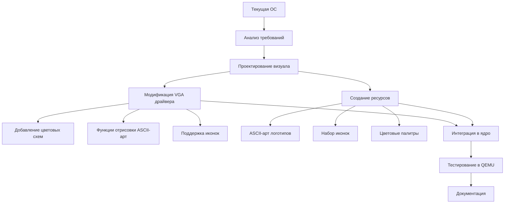

# Детальный план реализации визуала в стиле Warhammer 40k Mechanicum для ОС на ассемблере

## Анализ текущего состояния

### Текущая архитектура ОС
- **Режим работы**: Текстовый VGA (80x25 символов, 16 цветов)
- **Драйвер VGA**: [`os/os/src/kernel/vga.asm`](os/os/src/kernel/vga.asm) - расширенный драйвер с поддержкой цветов, курсора, прокрутки
- **Ядро**: [`os/os/src/kernel/kernel.asm`](os/os/src/kernel/kernel.asm) - точка входа, инициализация драйверов
- **Цветовая палитра**: Стандартная VGA 16-цветная палитра

### Возможности для модификации
1. **Цветовые атрибуты**: Каждый символ имеет байт атрибута (4 бита фона, 4 бита текста)
2. **Пользовательские цвета**: Можно переопределить палитру VGA через порты 0x3C8/0x3C9
3. **ASCII-арт**: Возможность отрисовки логотипов с помощью символов псевдографики
4. **Иконки**: Использование специальных символов (блоки, рамки) для интерфейса

## Требования к визуалу Warhammer 40k Mechanicum

### Цветовые схемы
- **Основные цвета**: Тёмно-красный (#8B0000), чёрный (#000000), металлический (#C0C0C0)
- **Акцентные цвета**: Зелёный (#00FF00 для энергии), бронзовый (#CD7F32), тёмно-серый (#404040)
- **Цветовые комбинации**:
  - Текст: светло-серый на чёрном (стандартный интерфейс)
  - Важные сообщения: красный на чёрном
  - Предупреждения: жёлтый на чёрном
  - Успех: зелёный на чёрном

### Логотипы и эмблемы Mechanicum
1. **Логотип Adeptus Mechanicus** - шестерня с черепом
2. **Эмблема Omnissiah** - символ машины
3. **Техно-символы** - цепи, шестерни, микросхемы

### Шрифты и иконки
- **Шрифт**: Моноширинный, техногенный (используем стандартный VGA шрифт)
- **Иконки интерфейса**:
  - ⚙️ Шестерня (символ 0x07)
  - 🔧 Гаечный ключ (символ 0x08) 
  - 🔩 Болт (символ 0x09)
  - ⚡ Молния (символ 0x0A)
  - 💾 Дискета (символ 0x0B)
  - 📁 Папка (символ 0x0C)

## Архитектура изменений



## Детальный план реализации

### Этап 1: Подготовка цветовых схем
1. **Создать файл цветовых палитр** `os/os/src/kernel/colors.asm`
   - Определение констант цветов Mechanicum
   - Функции установки пользовательской палитры VGA
   - Стандартные цветовые комбинации для интерфейса

2. **Модификация драйвера VGA** [`os/os/src/kernel/vga.asm`](os/os/src/kernel/vga.asm)
   - Добавить функцию `vga_set_palette` для установки пользовательской палитры
   - Добавить функцию `vga_set_mechanicum_colors` для применения цветовой схемы
   - Расширить `vga_set_color` для поддержки новых цветовых комбинаций

### Этап 2: Создание графических ресурсов
1. **ASCII-арт логотипов** в файле `os/os/src/kernel/logo.asm`
   - Логотип Adeptus Mechanicus (20x10 символов)
   - Эмблема Omnissiah (15x8 символов)
   - Заставка при загрузке (80x25 полный экран)

2. **Набор иконок** в файле `os/os/src/kernel/icons.asm`
   - Определение символов иконок (шестерня, ключ, болт и т.д.)
   - Функции отрисовки иконок в заданной позиции
   - Таблица соответствия иконок функциям системы

### Этап 3: Модификация ядра
1. **Обновление точки входа** [`os/os/src/kernel/kernel.asm`](os/os/src/kernel/kernel.asm)
   - Добавить вызов `vga_set_mechanicum_colors` после инициализации VGA
   - Добавить отрисовку логотипа при загрузке
   - Обновить приветственные сообщения в стиле Mechanicum

2. **Модификация оболочки** [`os/os/src/kernel/shell.asm`](os/os/src/kernel/shell.asm)
   - Добавить иконки перед командами
   - Изменить цветовую схему интерфейса
   - Добавить ASCII-арт статус-бара

### Этап 4: Интеграция и тестирование
1. **Сборка системы**
   - Обновить скрипт сборки [`os/os/build/build.sh`](os/os/build/build.sh)
   - Проверить зависимости между файлами

2. **Тестирование в QEMU**
   - Запуск эмулятора с обновлённым образом
   - Проверка цветовой схемы
   - Тестирование отрисовки логотипов и иконок
   - Проверка совместимости с существующими функциями

### Этап 5: Документация
1. **Обновление README.md** [`os/README.md`](os/README.md)
   - Добавить раздел о визуале Mechanicum
   - Скриншоты нового интерфейса

2. **Документация изменений** [`os/WORKLOG.md`](os/WORKLOG.md)
   - Запись выполненных работ
   - Описание новых функций

3. **Создание руководства** `os/docs/mechanicum_visual_guide.md`
   - Описание цветовых схем
   - Руководство по добавлению новых иконок
   - Примеры использования ASCII-арт

## Технические детали реализации

### Цветовая палитра VGA
```asm
; Цвета Mechanicum в формате VGA (R,G,B по 6 бит)
mechanicum_palette:
    db 0x00, 0x00, 0x00   ; 0: Чёрный
    db 0x2A, 0x00, 0x00   ; 1: Тёмно-красный
    db 0x30, 0x30, 0x30   ; 2: Тёмно-серый
    db 0xC0, 0xC0, 0xC0   ; 3: Металлический
    db 0x00, 0x2A, 0x00   ; 4: Тёмно-зелёный
    db 0xCD, 0x7F, 0x32   ; 5: Бронзовый
    ; ... остальные цвета
```

### ASCII-арт логотипа Adeptus Mechanicus
```
          .-.
         (o.o)
          |=|
         __|__
       //.=|=.\\
      // .=|=. \\
      \\ .=|=. //
       \\(_=_)//
        (:| |:)
         || ||
         () ()
         || ||
         || ||
        ==' '==
```

### Иконки интерфейса
```
Шестерня: ⚙ (символ 0x07)
Гаечный ключ: 🔧 (символ 0x08)
Болт: 🔩 (символ 0x09)
Молния: ⚡ (символ 0x0A)
Дискета: 💾 (символ 0x0B)
Папка: 📁 (символ 0x0C)
```

## Оценка сложности

### Низкая сложность
- Изменение цветовых констант
- Добавление ASCII-арт в виде строковых данных
- Обновление текстовых сообщений

### Средняя сложность
- Модификация драйвера VGA для поддержки пользовательской палитры
- Создание функций отрисовки иконок
- Интеграция с существующей системой

### Высокая сложность
- Изменение шрифта VGA (требует перепрограммирования контроллера)
- Создание анимаций или сложных графических эффектов
- Поддержка графического режима (переход из текстового)

## Риски и ограничения

1. **Ограничения текстового режима**: Максимум 80x25 символов, 16 цветов одновременно
2. **Совместимость**: Изменения не должны нарушать работу существующих драйверов
3. **Производительность**: Отрисовка сложного ASCII-арт может замедлить загрузку
4. **Тестирование**: Необходимость частого перезапуска эмулятора для проверки изменений

## Следующие шаги

1. **Одобрение плана** - обсуждение с заказчиком
2. **Реализация Этапа 1** - цветовые схемы
3. **Реализация Этапа 2** - графические ресурсы
4. **Интеграция и тестирование**
5. **Документация и финальная проверка**

## Приложения

### Приложение A: Цветовые коды VGA
| Цвет | Код | RGB (6-бит) | Использование |
|------|-----|-------------|---------------|
| Чёрный | 0x0 | 0,0,0 | Фон интерфейса |
| Тёмно-красный | 0x1 | 42,0,0 | Акцентные элементы |
| Металлический | 0x3 | 192,192,192 | Текст, границы |
| Зелёный | 0x2 | 0,42,0 | Статус "успех" |
| Бронзовый | 0x5 | 205,127,50 | Выделение |

### Приложение B: Символы псевдографики
```
┌─┬─┐   ╔═╦═╗   ╓─╥─╖
│ │ │   ║ ║ ║   ║ ║ ║
├─┼─┤   ╠═╬═╣   ╟─╫─╢
└─┴─┘   ╚═╩═╝   ╙─╨─╜
```

---

*План составлен: 2026-04-03*  
*Версия: 1.0*  
*Статус: На рассмотрении*