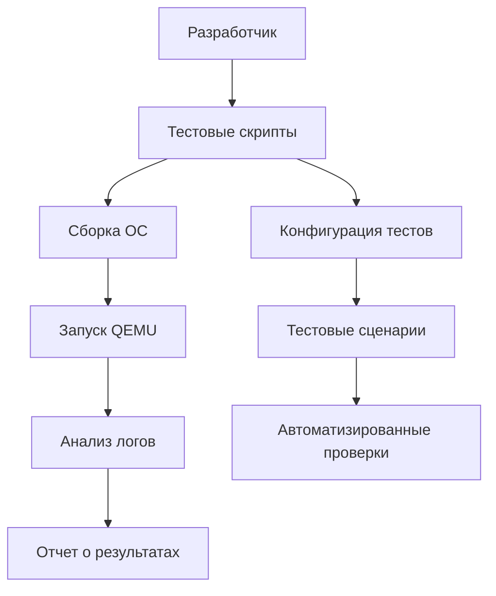

# План настройки локального тестового окружения для ОС

## Текущее состояние
Проект имеет хорошо настроенные CI/CD пайплайны GitHub Actions, но отсутствуют удобные инструменты для локального тестирования. Существующие тесты:
- Тестирование загрузчика (размер и сигнатура)
- Тестирование драйверов (клавиатура, таймер, последовательный порт, VGA)
- Тестирование файловой системы
- Тестирование сети
- Тестирование оболочки
- Тесты производительности

## Цель
Создать локальное тестовое окружение, позволяющее разработчику запускать тесты вручную в QEMU без необходимости полагаться на CI/CD.

## Архитектура тестового окружения



## План реализации

### Фаза 1: Базовое тестовое окружение
1. **Создать каталог для тестов** (`os/tests/`)
   - Подкаталоги по типам тестов
   - Общие утилиты для тестирования

2. **Разработать скрипт сборки с тестами**
   - Модификация `build.sh` для поддержки тестовых режимов
   - Создание отдельных образов для разных тестов

3. **Создать базовый тестовый фреймворк**
   - Утилиты для запуска QEMU с перенаправлением вывода
   - Парсеры логов для автоматической проверки результатов
   - Система отчетов

### Фаза 2: Тестовые сценарии
4. **Тестирование загрузчика**
   - Проверка размера boot.bin (512 байт)
   - Проверка сигнатуры 0x55AA
   - Тест загрузки в эмуляторе

5. **Тестирование драйверов**
   - Клавиатура: проверка обработки ввода
   - Таймер: проверка прерываний и точности
   - Последовательный порт: проверка вывода
   - VGA: проверка текстового режима

6. **Тестирование файловой системы**
   - Чтение/запись файлов
   - Навигация по директориям
   - Работа с FAT32

7. **Тестирование сетевого стека**
   - Инициализация сетевой карты
   - Базовые сетевые операции

### Фаза 3: Интеграционные тесты
8. **Тестирование оболочки**
   - Выполнение команд
   - Работа с историей
   - Обработка ошибок

9. **Тестирование планировщика задач**
   - Переключение контекста
   - Приоритеты задач
   - Межпроцессное взаимодействие

10. **Тестирование памяти**
    - Страничная память
    - Выделение/освобождение памяти
    - Защита памяти

## Todo List для реализации

### Высокий приоритет
- [ ] Создать структуру каталогов для тестов
- [ ] Разработать базовый тестовый скрипт `run_test.sh`
- [ ] Создать утилиты для работы с QEMU
- [ ] Реализовать тестирование загрузчика
- [ ] Реализовать тестирование драйверов

### Средний приоритет
- [ ] Создать тесты файловой системы
- [ ] Разработать интеграционные тесты
- [ ] Добавить систему отчетов
- [ ] Создать документацию по тестированию

### Низкий приоритет
- [ ] Реализовать тесты производительности
- [ ] Создать графический интерфейс для тестов
- [ ] Интеграция с IDE (VSCode)
- [ ] Автоматическое тестирование при коммитах

## Структура файлов
```
os/tests/
├── unit/              # Юнит-тесты отдельных компонентов
├── integration/       # Интеграционные тесты
├── performance/       # Тесты производительности
├── scripts/           # Вспомогательные скрипты
├── utils/             # Утилиты тестирования
├── config/            # Конфигурация тестов
├── results/           # Результаты тестов
└── README.md          # Документация
```

## Требования к окружению
- NASM 2.14+
- QEMU 4.0+
- Bash или совместимая оболочка
- Python 3.8+ (для продвинутых тестов)

## Ожидаемые результаты
1. Ускорение разработки за счет быстрого локального тестирования
2. Снижение зависимости от CI/CD для базового тестирования
3. Улучшение качества кода за счет более частого тестирования
4. Стандартизация процесса тестирования

## Следующие шаги
1. Утвердить план с разработчиком
2. Начать реализацию с Фазы 1
3. Постепенно добавлять тестовые сценарии
4. Интегрировать с существующим CI/CD

---
*План создан: 2026-04-03*  
*Версия: 1.0*  
*Статус: На рассмотрении*